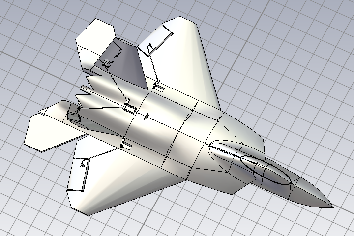
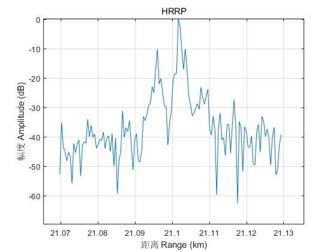

本项目在持续更新中...
This repo is continuously being updated...

# RadarSigToolkit
本项目包含雷达回波仿真、信号处理等基本功能
This a toolkit for radar signal's simulation, processing, etc.

## 目录 Content

### 回波仿真 Echo Simulation

#### 一些样例 Examples
* 生成的回波 Simulated echo
* 微多普勒 Micro Doppler
* [高分辨距离像 High resolution range profile (HRRP)](./SignalProcessing/SynHrrp/)
  * 目标模型

  * 合成HRRP

### 信号处理 Signal Processing

#### 一些样例 Examples
* 频率捷变雷达距离速度恢复 Range and velocity recovery by the RSF radar
