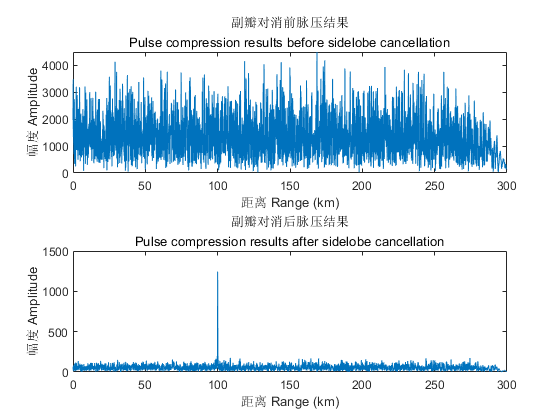

# 旁瓣对消 Sidelobe Cancellation

一种利用辅助阵面消除旁瓣干扰的技术。

A technique that uses auxiliary arraies to eliminate the interference from sidelobes.

## 原理
[王龙平. 基于L波段相控阵雷达的旁瓣对消算法研究与实现[D].电子科技大学,2013.](https://oversea.cnki.net/KCMS/detail/detail.aspx?dbcode=CMFD&dbname=CMFD201401&filename=1013334486.nh&uniplatform=OVERSEA&v=7OBr8ODs0h8uv-8EiMEosluUI_oLp3uRylocPVN2bDIl2RkfBC_7ysdNyClBSHTL)

## 样例 Example

* 在副瓣对消前，存在着严重的压制式干扰
* 副瓣对消后，干扰被抑制，通过脉冲压缩能够发现目标