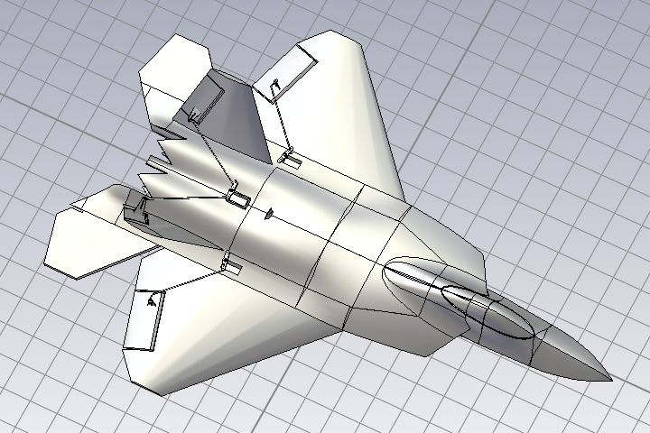
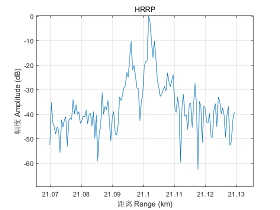

# 合成高分辨距离像 Synthesis HRRP
HRRP: High Resolution Range Profile

## 目录 Content
* doc/
  * The dir saving the documents.
* image/
  * The dir saving example images. 
* Demo_SynHrrp.m
  * Main function.
* syn_hrrp.m
  * The function which synthesis hrrp.

## 样例
* 目标模型

* 仿真回波

* 脉冲压缩结果

* 合成HRRP
